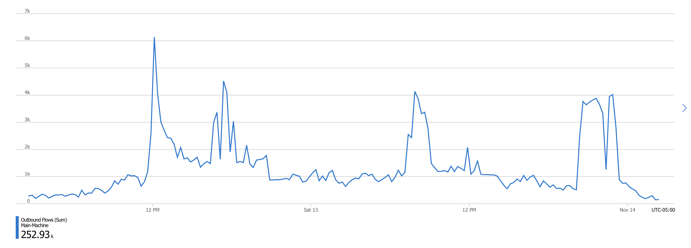
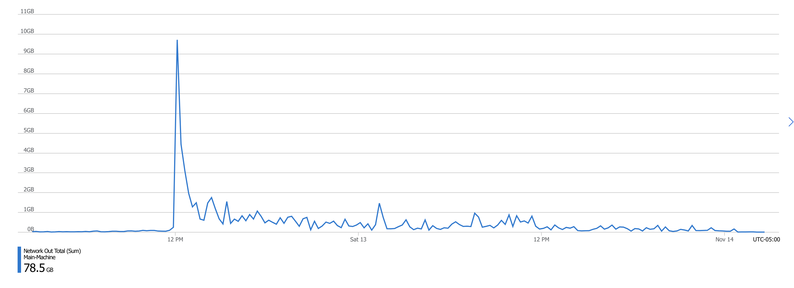
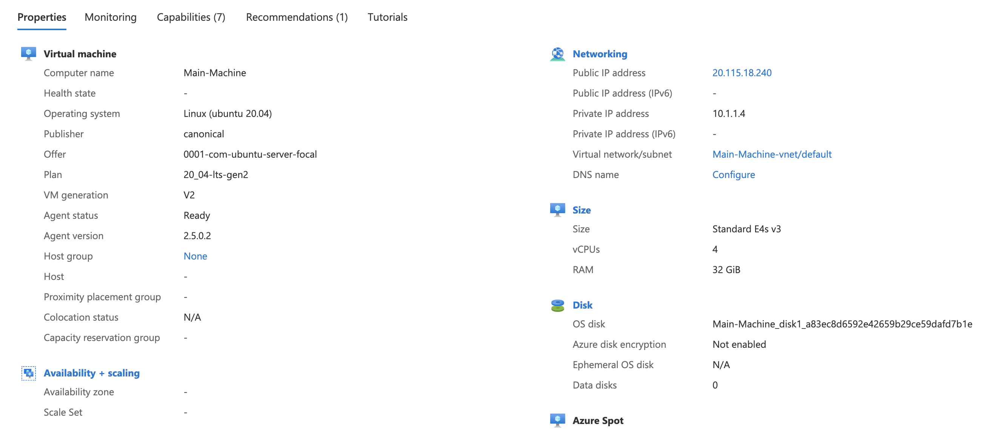
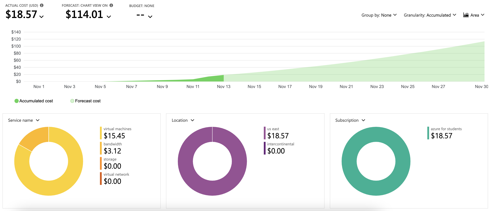

# K3RN3LCTF-2021
Repository with the downloadable files and server files for the 2021 K3RN3LCTF.

## How to create the docker images

---

If you want to test a remote challenge after the ctf you can, on a linux machine with docker installed, go into the folder for the challenge and then run:

```
sudo docker-compose up
```

if you want to run the image in the background you can run:

```
sudo docker-compose up -d
```

This will create the docker image on whatever port is specified in docker-compose.yml. To double check what port a container is running on you can run:

```
sudo docker ps
```

When the image has been started you can connect to it with:

```
nc 0.0.0.0 port
```

All challenges can be started up from this repository except for wyze guy as it requires a 3 GB file that cannot be added to github.

## Infrastructure

---

### Stats

---

Infrastructure was one of the components of the ctf that we were most worried about since oftentimes infrastructure can make or break an entire CTF. Originally we were expecting around 300-500 people to compete as this was our first CTF, however in the end we had almost 2,000 people competing in over 500 teams.


During the CTF our server handled almost 253,000 connections



And people downloaded almost 80 GBs worth of data from the server.


### Server Specs

---

For our hosting we decided to use Microsoft Azure, this was due to the free server (without scaling) for students, which allowed us to get things set up and tested a bit without using up any money. We also got $100 in free credits that we could then use when we decided to scale up.

While setting everything up intially we were running the b1s which had 1 core, 1 GB RAM, and 4 GB temp storage. This was enough to set up the website and do some other initial setup but was not enough to do more than one thing at a time. This was completely free with the student subscription though.

The friday before the CTF started we wanted to open up the registration so I scaled up the server a bit to handle the extra traffic as well as letting us have one or two docker containers running at a time for testing and setup. I scaled up to the b2s which had 2 cores, 4 GB RAM, and 8 GB temp storage. The scaled up server cost us $0.0416 per hour that it was running and allowed us to do all the testing we needed to do.

Roughly 24 hours before the start of the CTF I scaled our vm up all the way, this was so that I could do some extra load testing as well being able to launch all docker images for a final round of testing. For this I scaled the server to an E4s v3 which had 4 cores, 32 GB RAM, and 64 GB temporary storage and cost us $0.252 an hour.



### Setting up services and website

---

For the website we used the platform one of my teammates built: [ImaginaryCTF](https://github.com/Et3rnos/ImaginaryCTF) which did a great job at handling everything we needed.

I won't go fully in depth for how to set up the site since most of that is covered in his repository.

After downloading and setting up mysql and the ImaginaryCTF website I set up services for the bot and website so that they would boot on website start. In `/etc/systemd/system/` I added the following files:


website.service
```
[Unit]
Description=website
[Service]
WorkingDirectory=/home/azureuser/source/iCTF Website/bin/Release/net5.0/publish/
ExecStart=/usr/bin/dotnet "/home/azureuser/source/iCTF Website/bin/Release/net5.0/publish/iCTF Website.dll"
Restart=always
[Install]
WantedBy=multi-user.target
```

bot.service
```
[Unit]
Description=bot
[Service]
WorkingDirectory=/home/azureuser/source/iCTF Website/bin/Release/net5.0/publish/
ExecStart=/usr/bin/dotnet "/home/azureuser/source/iCTF Discord Bot/bin/Release/net5.0/publish/iCTF Discord Bot.dll"
Restart=always
[Install]
WantedBy=multi-user.target
```

Once these were added I ran:

```
sudo systemctl enable website
sudo systemctl enable bot
```

to enable to services on restart. With that the website and bot were pretty much complete. (I only launched the bot once I scaled up to the B2s).

Et3rn0s and I also set up an update script in the source folder:

```bash
systemctl stop bot
systemctl stop website
rm -r iCTF\ Website/bin/
rm -r iCTF\ Discord\ Bot/bin/
dotnet publish -c release
systemctl start bot
systemctl start website
```

This allowed us to update the website quickly with any changes by running `sudo bash update.sh`. When we were fully scaled up this update script allowed us to update the downloadable files with less than 5-10 seconds website downtime which meant we could update parts without inconveniencing players.

All downloadable files were in the download repository detailed in the `Update Pipeline` section of this guide. This was simply cloned to the wwwroot of the website and then after changes were done I simply had to run the update script.

The component that took the longest to figure out was how we wanted to properly set up all the nc connections. I ended up deciding to use [RedPwn jail](https://github.com/redpwn/jail) as this gave us a good amount of control over timeouts and had built in protections against things like fork bombs.

All of our docker files are available in the server-files repository but as I had some issues with the python files at first I wanted to give an example:

Python Dockerfile
```
FROM python:slim AS app

RUN pip install --no-cache-dir pycryptodome 

FROM redpwn/jail
COPY --from=app / /srv
COPY flag.txt /srv/app/flag.txt

COPY 1-800-758-6237.py /srv/app/run


ENV JAIL_TIME 120
ENV JAIL_CONNS_PER_IP 1
ENV JAIL_MEM 20M
```

For the python dockerfiles we ended up wanting to install from python as slim, this saved lots of space however it caused us to have to redo the shebangs in all the python scripts to include: `#!/usr/local/bin/python`. You also will need to chmod all python scripts that will be running in the image.

Once you have a docker file you will need to set up the docker-compose.yml in order to set the port number:

```
version: '3.3'
services:
  deployment:
    build: .
    ports:
      - <insert port you want>:5000
    cap_drop:
      - all
    cap_add:
      - chown
      - setuid
      - setgid
      - sys_admin
    security_opt:
      - apparmor=unconfined
      - seccomp=unconfined
```

You can then edit the firewall rules on portal.azure.com by going to Networking under your virtual machine and allowing ports that you have containers running on.

### Update pipeline

---

I tried setting up a system where the least amount of people would need access to the infrastructure as possible in an attempt to keep it clean and without conflicts. However, I also did not want to have to set up everything myself and I wanted that we could update files quickly without needing to connect to some sort of sFTP.

In order to do this I set up two repositories, one with the downloadable files and one for the server files needed for docker instances. These have since been consolidated into this repository under downloadable and server-files. 

What this did was make that anybody on the team could update their files and push to the repository and then one of the people with server access just needed to pull the repository and rebuild. This let us update any file we needed within 30 seconds.

### Analysis of infrastructure

---

The E4s was most likely a bit of overkill for the CTF as we never went over 3 GB RAM used and at the start of the CTF the cpu usage never went over 50% either. If you are going to try to do a scaled down version I recommend prioritizing cores over lots more RAM.

#### Cost analysis

---

For this CTF we ended up running the b2s for 168 hours and the E4s for roghly 24 hours before the ctf, 36 hours for the ctf, and roughly 9 hours after the ctf. This resulted roughly in the following costs:

|Usage|Time|Cost per Hour|Total|
|:---:|:--:|:-----------:|:---:|
|B2s scaling for week|~168|$0.0416|~$7|
|E4s for roughly 20 hours prior to ctf|~20|$0.252|~$5|
|E4s for ctf|36|$0.252|$9.07|
|E4s for around 8 hours after ctf|~8|$0.252|~$2|

However, in the end some of the times ended up being a bit shorter so we only ended up spending $18.57 on the entire CTF.



#### What could have been done better

---

Overall I think I did pretty well with the infrastructure, however, there was one issue where some of the python docker containers that needed large imports like numpy were a bit slow to start. I will most likely do some more testing to try to fix this and then update this guide.

## Special thanks to all my teammates!!

---

[Polymero](https://github.com/Polymero)

[Playoff-Rondo](https://github.com/thisusernameistaken)

[Bex](https://github.com/Bex32)

[Seal](https://seal9055.com/)

[DrDoctor](https://github.com/kavandoctor1)

[Et3rnos](https://github.com/Et3rnos)

[Castilho](https://github.com/castilho101)

Abda

[TheEasyPeasy](https://github.com/TheEasyPeasy)